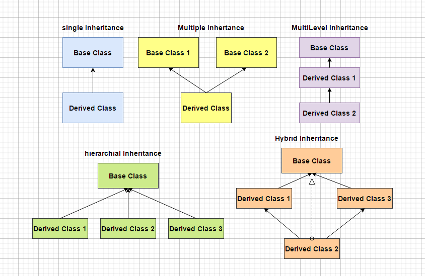

# C++ is "C with Classes"

The goal of these modules is to introduce you to Object-Oriented Programming.
This will be the starting point of your C++ journey.
Many languages are recommended to learn OOP.

## Cpp 00 - 01 :

### Namespace :
  A namespace is a feature that allows you to organize and encapsulate code into logical groups
Namespace provide the space where we can define or declare identifier i.e. variable,method, classes.

- stdio streams : Standard Input / Output Streams Library (iostream)
- cin : Standard input stream (object)
- cout : Standard output stream (object)
- cerr : Standard output stream for errors (object)
- clog : Standard output stream for logging (object)
- WRITE : the stream insertion operator (<<)
- READ : the stream extraction operator (>>)

### Scope resolution operator “::” 
  Here std is used in front of cin and cout along with scope resolution operator, which indicates that the object cin and cout are defined inside the namespace whose name is std. The std is the standard library, and both cin and cout are defined inside this scope.

### Cout : 
  The cout object in C++ is an object of class iostream. It is defined in the iostream header file. It is used to display the output to the standard output device i.e. monitor. It is associated with the standard C output stream stdout. The data needed to be displayed on the screen is inserted in the standard output stream (cout) using the insertion operator(<<).

### Header:
- hpp : C++ Headers.
  - h : C/C++ compatible or pure C Headers.

### Classes :
  Classes are an expanded concept of data structures: like data structures, they can contain data members, but they can also contain functions as members.
- public: members can be accessed outside the class.
- private: members cannot be accessed outside the class.
- protected: members cannot be accessed(viewed) from outside the class, but can be accessed in inherited classes(subclasses).

### This Pointe : (this->)
Every object has a special pointer this which points to the object itself.


## Cpp 02 :

### Canonical Form :  https://www.shiksha.com/online-courses/articles/constructors-in-cpp/

- Default Constructor : 
	class can include a special function called constructor, which is automatically called whenever a new object of this class is created. This constructor function must have the same name as the class, and cannot have any return type; not even void.

- Copy constructor :
  	A copy constructor is a member function that initializes an object using another object of the same class. In simple terms, a constructor which creates an object by initializing it with an object of the same class, which has been created previously, is known as a copy constructor.
  
- Assignment Operator.
- 
- Destructor :
	The destructor fulfills the opposite functionality. It is automatically called when an object is destroyed, either because its scope of existence has finished (for example, if it was defined as a local object within a function and the function ends) or because it is an object dynamically assigned and it is released using the operator delete.

### Copy Constructor vs Assignment Operator in C++ :
A copy constructor is used to initialize a previously uninitialized object from some other object's data.
An assignment operator is used to replace the data of a previously initialized object with some other object's data.

### Dummy parameter :
The int parameter is a dummy parameter used to differentiate between prefix and postfix versions of the operators (++a | - -a | a++ | a- - ).


### Static : 
1. Local Static: static var inside of a function: value sticks around throughout program lifetime so the same value sticks around if you reRun the function (only gets initialized once.
2. Static globally scoped var / func: Makes it visible only in this file, normally globals would be visible everywhere in program when linked.
3. Static Class Vars or Functions: belongs to root class, not instances of it, same values shared across all instances (so cant access instance variables/'this' from static methods).

### Ad-hoc Polymorphism :	
Ad-hoc Polymorphism, also called as Overloading Ad-hoc Polymorphism allows functions having the same name to act differently for different types.

### Const member function:
- When a function is declared as const, it can be called on any type of object, const object as well as non-const objects.
- Whenever an object is declared as const, it needs to be initialized at the time of declaration. However, the object initialization while declaration is possible only with the help of constructors.
- A function becomes const when the const keyword is used in the function’s declaration. The idea of const functions is not to allow them to modify the object on which they are called.
- It is recommended practice to make as many functions const as possible so that accidental changes to objects are avoided.

### Fixed-point: 
is a method of representing fractional numbers by storing a fixed number of digits of their fractional part.

## Cpp 03 :

### Types of inheritance :
- Single Inheritance.
- Multiple Inheritance.
- Multilevel Inheritance.
- Hierarchical Inheritance.
- Hybrid Inheritance.



### Why can't inherit constructors?

Constructors are different from other class methods in that they create new objects, whereas other methods are invoked by existing objects. This is one reason constructors aren't inherited.

### Private vs Protected :

- Private members are only accessible within the class defining them.
- Protected members are accessible in the class that defines them and in classes that inherit from that class.

## Cpp 04 :

### Virtual Table (vtable):
For every class that contains virtual functions, the compiler constructs a virtual table. The vtable contains an entry for each virtual function accessible by the class and stores a pointer to its definition. Only the most specific function definition callable by the class is stored in the vtable.

### Virtual: (it's just a general idea)
When the term “virtual” is used , the function will be called based on object type not the pointer type.


When we use virtual in base_class destructor we tell the program to include the destructor of derived class in the Vtable; automatically when the derived class finishes he calls our destructor,and the base destructor that inherited from.

## Cpp 05 :

### Exception: 
is a class in iostream that has many derived classes that can handle the Throw exception and give it a specific message with a  what() throw() (virtual function).

## Cpp 06 :

**Conversion operator(operator type_name): operator float() { return b_float; }**
**Conversion Constructor: NameOfCLASS(NameOfCLASS) { return b_float; }.**


#### uintptr_t:
is an unsigned long integer type that is capable of storing a data pointer.

#### implicit vs explicit:
Implicit type conversion is done automatically by the compiler, while explicit type conversion is done manually by the programmer.

### Casting Types:

### Static cast : static_cast <dest_type> (source); (Compile_time)
It does things like implicit conversions between types
(such as int to float, or pointer to void*), and it can also call explicit conversion functions.

### Dynamic_cast : dynamic_cast <dest_type> (source), (run_time)
Is mainly used for safe downcasting at run time. To work on dynamic_cast there must be one virtual function in the base class. A dynamic_cast works only in a polymorphic (A class that declares or inherit s a virtual function is called a polymorphic class) base class because it uses this information to decide safe downcasting.

### Reinterpret_cast : reinterpret_cast <dest_type> (source) (run_time)
It is used to convert a pointer of some data type into a pointer of another data type, even if the data types before and after conversion are different.
It does not check if the pointer type and data pointed by the pointer is the same or not.


### Const_cast : ** const_cast <dest_type> (source) (run_time) ** 
const_cast is used to cast away the constness of variables. Following are some interesting facts about const_c.
```
Static class :
#### 1 . In C++, a "static class" has no meaning.
The nearest thing is a class with only static methods and members.
#### 2 . Using static methods will only limit you.
```
